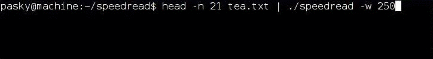
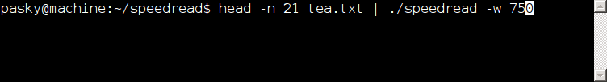
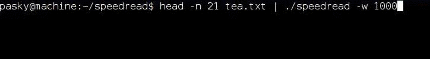

speedread
=========

A simple terminal-based open source Spritz-alike.

This command line filter shows input text as a per-word RSVP (rapid
serial visual presentation) aligned on optimal reading points.  This
kind of input mode allows reading text at a much more rapid pace than
usual as the eye can stay fixed on a single place.

Basic Example
-------------

	cat tea.txt | ./speedread -w 250

The default of 250 words per minut is very timid, designed so that you get
used to this.  Be sure to try cranking this up, 500wpm should still be fairly
easy to follow even for beginners.

Controls
--------

speedread is slightly interactive, with these controls accepted:

  * [ - slow down by 10%
  * ] - speed up by 10%
  * space - pause (and show the last two lines of context)

Integration Recipes
-------------------

You can connect mutt with speedread by putting a macro like this in your
~/.muttrc (or pressing ':' in running mutt and pasting it):

	macro pager R "<enter-command>set pipe_decode=yes<enter>v|grep -v '^>' | ~/speedread/speedread<enter><enter-command>unset pipe_decode<enter>q" "speedread"

Then, just press R when viewing a message.  Unfortunately, it does not
work with non-ASCII messages (probably due to mutt limitations).

TODO
----

Not sure if I will ever get around to these...

  * Better word timing! Instead of just pausing longer at commas and
    full-stops, distribute time better. Some short words like "not"
    and "can" could often get missed the way things are now.
  * Support for seeking back/forward.
  * Automatically adjust wpm on trained content difficulty (look-ahead)?
  * More controls, explore how can interactivity enhance usefulness of this.
  * Make various timing and ORP coefficients configurable.
  * Add a (Cairo-based?) simplistic graphical frontend (keeping with the
    filter philosophy). This would allow better eye guidance and large font.
  * An elinks-based recipe for reading websites this way.

Check out also [OpenSpritz](https://github.com/Miserlou/OpenSpritz) or
[spritz-js](https://github.com/richardtagger/spritz-js) if you want to
get this functionality in the web context.
